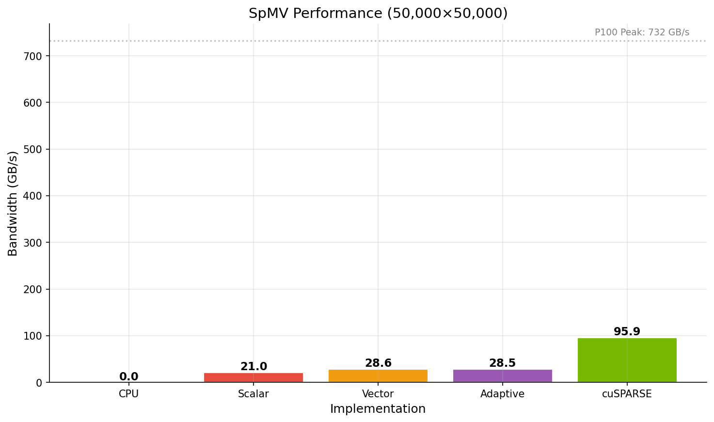
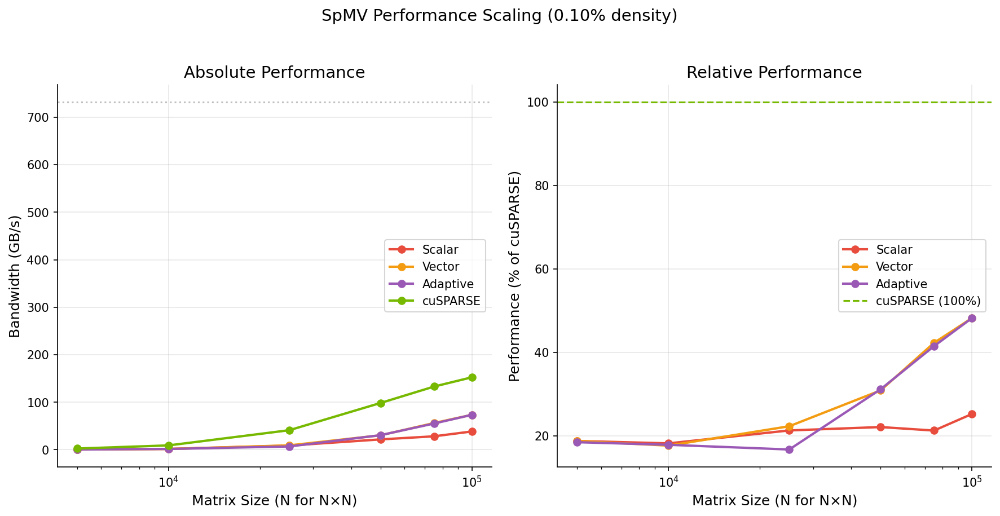
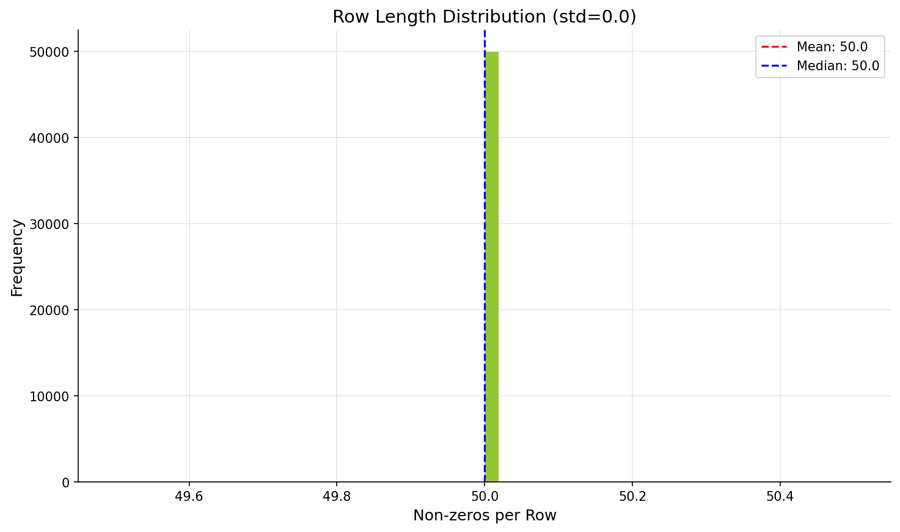
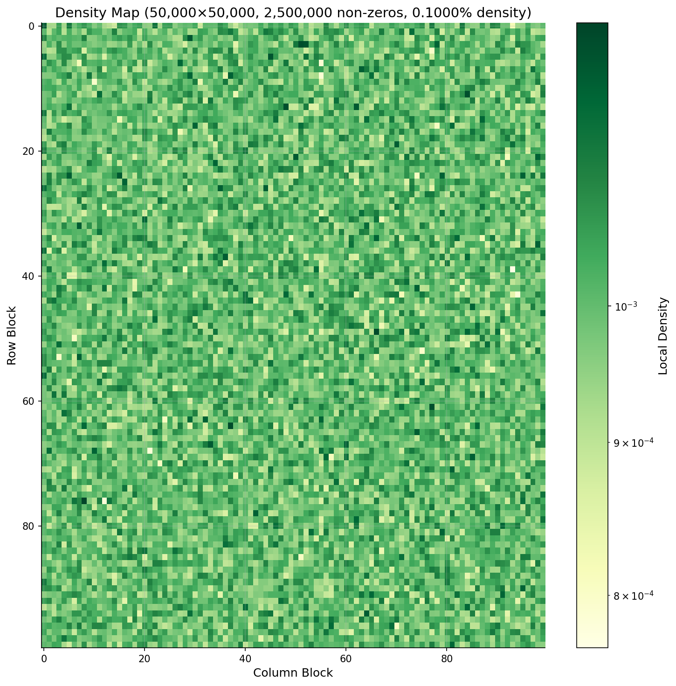
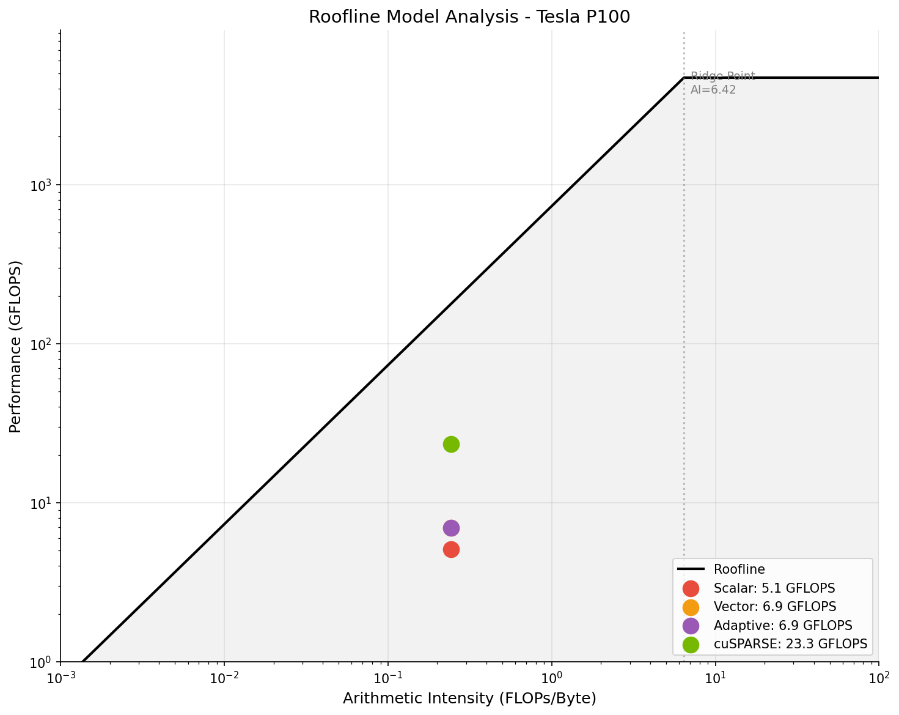

# GPU-Accelerated Sparse Matrix Operations

[](https://developer.nvidia.com/cuda-toolkit)
[](https://python.org)
[](https://numba.pydata.org/)
[](LICENSE)

High-performance sparse matrix kernels implemented in Python/Numba CUDA, targeting the Tesla P100 GPU. This project demonstrates GPU optimization techniques for memory-bound, irregular-access workloads — the core challenges in NVIDIA's cuSPARSE library.

<p align="center">
  
</p>

## Project Goals

1. **Understand sparse matrix challenges** — irregular memory access, load imbalancing, low arithmetic intensity
2. **Implement multiple SpMV kernel strategies** — scalar, vector, and adaptive approaches
3. **Benchmark against cuSPARSE** — honest comparison with NVIDIA's production library
4. **Progressive optimization** — demonstrate performance engineering methodology

## Benchmark Results

**Hardware:** Tesla P100-PCIE-16GB (732 GB/s peak bandwidth)  
**Density:** 0.1% (typical for scientific computing)

### Single Matrix Performance (50K x 50K)

| Implementation | Time (ms) | Bandwidth (GB/s) | % Peak | Speedup vs CPU |
|----------------|-----------|------------------|--------|----------------|
| NumPy (CPU)    | 1536.6    | —                | —      | 1.0x           |
| **Scalar**     | 0.980     | 21.0             | 2.9%   | 1,568x         |
| **Vector**     | 0.720     | 28.6             | 3.9%   | 2,136x         |
| **Adaptive**   | 0.722     | 28.5             | 3.9%   | 2,127x         |
| cuSPARSE       | 0.215     | 95.9             | 13.1%  | 7,157x         |

<p align="center">
  
</p>

### Scaling Study

Performance improves significantly with matrix size due to better GPU utilization:

| Matrix Size     | Non-zeros | Vector (GB/s) | % Peak    | % of cuSPARSE | Speedup vs CPU |
|-----------------|-----------|---------------|-----------|---------------|----------------|
| 5K x 5K         | 25K       | 0.5           | 0.1%      | 20%           | 31x            |
| 10K x 10K       | 100K      | 1.6           | 0.2%      | 18%           | 120x           |
| 25K x 25K       | 625K      | 9.1           | 1.2%      | 22%           | 671x           |
| 50K x 50K       | 2.5M      | 30.4          | 4.2%      | 31%           | 2,222x         |
| 75K x 75K       | 5.6M      | 56.2          | 7.7%      | 42%           | 4,223x         |
| **100K x 100K** | **10M**   | **73.5**      | **10.0%** | **48%**       | **5,432x**     |

<p align="center">
  
</p>

### Performance Analysis

At large matrix sizes, implementation achieves **48% of cuSPARSE** and **10% of peak bandwidth**. The remaining gap is due to:

| Bottleneck               | Impact                | Planned Optimization        |
|--------------------------|-----------------------|-----------------------------|
| Scattered vector access  | ~3x slowdown          | Shared memory caching       |
| No row binning           | Poor load balance     | Length-based kernel dispatch|
| Basic CSR format         | Suboptimal coalescing | CSR5 / HYB format           |

<p align="center">
  
  <br/>
  <em>Row length distribution affects load balancing across GPU threads</em>
</p>

## Why Sparse Matrices Are Hard on GPUs

<p align="center">
  
</p>

Unlike dense GEMM with predictable memory patterns, SpMV faces fundamental challenges:

```
Dense GEMM:                     Sparse SpMV:
┌─────────────────┐             ┌─────────────────┐
│ ■ ■ ■ ■ ■ ■ ■ ■ │             │ ■ · · ■ · · · ■ │  ← Scattered non-zeros
│ ■ ■ ■ ■ ■ ■ ■ ■ │             │ · ■ · · · ■ · · │  
│ ■ ■ ■ ■ ■ ■ ■ ■ │             │ · · ■ ■ · · ■ · │  Random x[col] access
│ ■ ■ ■ ■ ■ ■ ■ ■ │             │ ■ · · · ■ · · ■ │  → Poor coalescing
└─────────────────┘             └─────────────────┘
Coalesced access               Irregular access 
```

**Arithmetic Intensity:** SpMV performs only 2 FLOPs per non-zero but loads ~12 bytes, yielding AI = 0.17 FLOP/byte — far below P100's ridge point of 6.4 FLOP/byte. This makes SpMV fundamentally **memory-bound**.

## Architecture

```
sparse_kernels/
├── README.md
├── main.py                     # Entry point - runs benchmarks + generates figures
├── formats/
│   └── csr.py                  # CSR storage + 3 SpMV kernel variants
├── benchmarks/
│   └── spmv_benchmark.py       # Timing, bandwidth calculation, cuSPARSE comparison
├── visualization/
│   └── plots.py                # Sparsity patterns, roofline, performance charts
└── docs/
    └── figures/
        ├── summary.png             # Combined performance overview
        ├── performance_comparison.png
        ├── scaling.png             # Performance vs matrix size
        ├── roofline.png            # Memory-bound analysis
        ├── sparsity_pattern.png    # Matrix structure visualization
        └── row_distribution.png    # Load balancing analysis
```

## Quick Start

### Prerequisites

```bash
pip install numpy numba matplotlib

# Optional: for cuSPARSE comparison
pip install cupy-cuda12x  # Match your CUDA version
```

### Run Benchmarks

```bash
# Full benchmark with visualizations
python3 main.py

# Quick kernel test
python3 formats/csr.py

# Benchmark only
python3 benchmarks/spmv_benchmark.py
```

### Example Usage

```python
from formats.csr import CSRMatrix, spmv_gpu_vector
import numpy as np

# Create sparse matrix (50K x 50K, 0.1% density)
A = CSRMatrix.random(50000, 50000, density=0.001, seed=42)
x = np.random.randn(50000).astype(np.float32)

# GPU SpMV — 2000x faster than NumPy
y_gpu = spmv_gpu_vector(A, x)
y_result = y_gpu.copy_to_host()

print(f"Matrix: {A}")
# CSRMatrix(shape=(50000, 50000), nnz=2500000, density=0.10%)
```

## Kernel Implementations

### 1. Scalar Kernel — One Thread per Row

```python
@cuda.jit
def spmv_csr_scalar_kernel(data, indices, indptr, x, y, num_rows):
    row = cuda.grid(1)
    if row < num_rows:
        dot = 0.0
        for j in range(indptr[row], indptr[row + 1]):
            dot += data[j] * x[indices[j]]
        y[row] = dot
```

- [+] Simple, low overhead  
- [-] Thread divergence when row lengths vary  
- Result: **21.0 GB/s** (2.9% peak)

### 2. Vector Kernel — One Warp per Row

Uses 32 threads collaboratively per row with warp shuffle reduction.

- [+] Better for rows with many non-zeros  
- [-] Wastes threads on short rows  
- Result: **28.6 GB/s** (3.9% peak)

### 3. Adaptive Kernel

Selects scalar vs vector strategy based on row length threshold.

- [+] Balances both approaches  
- Result: **28.5 GB/s** (3.9% peak)

## Roofline Analysis

<p align="center">
  
</p>

SpMV operates in the **memory-bound** region:
- Arithmetic Intensity: **0.17 FLOP/byte**
- P100 Ridge Point: 6.4 FLOP/byte
- Maximum achievable: ~125 GFLOPS (limited by 732 GB/s bandwidth)

At 100K x 100K matrices, our Vector kernel achieves **73.5 GB/s** (10% of peak) compared to cuSPARSE's 152.5 GB/s (21% of peak). The gap comes from non-coalesced vector access patterns.

## Roadmap

### Phase 1: Baseline Implementation [DONE]
- [x] CSR format with three kernel variants
- [x] Benchmarking infrastructure
- [x] Visualization suite
- [x] cuSPARSE comparison

### Phase 2: Optimization (Current)
- [ ] Shared memory caching for vector x
- [ ] Row binning by length
- [ ] Block size tuning
- [ ] COO format for very sparse matrices

### Phase 3: Advanced Formats
- [ ] ELL format for uniform row lengths
- [ ] HYB (hybrid ELL + COO)
- [ ] CSR5 for optimal coalescing

### Phase 4: Extended Operations
- [ ] SpMM (Sparse x Dense matrix)
- [ ] SpGEMM (Sparse x Sparse)
- [ ] Iterative solvers (CG, BiCGSTAB)

## References

- Bell & Garland, ["Efficient Sparse Matrix-Vector Multiplication on CUDA"](http://www.nvidia.com/docs/IO/66889/nvr-2008-004.pdf) (2008)
- Merrill & Garland, ["Merge-Based Parallel Sparse Matrix-Vector Multiplication"](https://research.nvidia.com/publication/merge-based-parallel-sparse-matrix-vector-multiplication) (2016)
- [NVIDIA cuSPARSE Documentation](https://docs.nvidia.com/cuda/cusparse/)
- [Numba CUDA Documentation](https://numba.readthedocs.io/en/stable/cuda/)

## Hardware

**Tesla P100-PCIE-16GB**

| Spec          | Value             |
|---------------|-------------------|
| Architecture  | Pascal (SM 6.0)   |
| CUDA Cores    | 3,584             |
| Memory        | 16 GB HBM2        |
| Bandwidth     | 732 GB/s          |
| FP32 Peak     | 9.3 TFLOPS        |

## License

MIT License — see [LICENSE](LICENSE) for details.

## Author

**Andrey Maltsev**  
GPU Computing & HPC, RHEL Engineer  

---

*Part of my GPU computing portfolio demonstrating sparse linear algebra optimization. See also: [CUDA Matrix Multiplication](https://github.com/maltsev-andrey/cuda_kernels/tree/main/linear-algebra/gemm), [N-Body Simulation](../simulation/n-body)*

